# Campus Services Portal

A comprehensive, enterprise web application built for university students and administrators. The portal streamlines university operations including student onboarding, hostel housing, computer and science lab workstation reservations, event registration, certificate issuance, student complaint triage, fee management, and immutable audit tracking.

---

## 🔑 Default Administrator Credentials (Auto-Created on Startup)

On the very first launch, the ASP.NET Core backend automatically seeds the primary SuperAdmin account in `Program.cs` if one does not already exist:

| Parameter | Default Value | Notes |
| :--- | :--- | :--- |
| **Email / Username** | `admin@campus.edu` | Primary administrative login identity |
| **Password** | `123` | Auto-hashed with BCrypt on initial startup |
| **Role** | `SuperAdmin` | Highest privilege tier: access to all admin modules & user management |
| **Full Name** | `System Administrator` | Pre-configured administrator display name |
| **Account Status** | `Active` (Verified) | Ready for immediate sign-in |

> **Note**: An additional administrator account (`raja@admin.co.lk`) is also pre-configured for administrative operations.

---

## 💻 Tech Stack

### Frontend
- **Framework**: Angular 19.2.1 (100% Standalone Components, no `NgModule`)
- **State & Reactivity**: Fine-grained Angular Signals (`signal`, `computed`, `effect`) and RxJS Observables
- **Forms**: Typed Reactive Forms with custom validators & dynamic `FormArray` collections; pragmatic Template-Driven forms
- **Styling & UI**: Tailwind CSS v3, custom responsive CSS, Heroicons/SVG, full Light/Dark theme switching
- **HTTP Client**: Typed `HttpClient` with functional interceptors for JWT Bearer token attachment and global error handling

### Backend
- **Framework**: ASP.NET Core 8 Web API
- **Architecture**: Clean Architecture / Repository & Service Pattern
- **ORM & Database Access**: Entity Framework Core 8 with Code-First Migrations, EF Interceptors for Audit logging
- **Database Engine**: Microsoft SQL Server / SQL Server LocalDB
- **Security & Tokens**: JWT (JSON Web Tokens) with HMAC-SHA512 signing, BCrypt password hashing, refresh token rotation
- **Documentation**: Swagger / OpenAPI with Swashbuckle UI and Bearer Token Security Locking
- **Email & Communications**: MailKit SMTP integration with simulated fallback mode

---

## 🛠️ Setup Instructions

### Prerequisites
- [.NET 8.0 SDK](https://dotnet.microsoft.com/download/dotnet/8.0)
- [Node.js (v20.x or higher)](https://nodejs.org/) & `npm`
- [Microsoft SQL Server](https://www.microsoft.com/sql-server/) or SQL Server LocalDB (included with Visual Studio)

---

### Step 1: Database Setup
1. Verify that your SQL Server / LocalDB instance is running.
2. The connection string in `Backend/appsettings.json` defaults to:
   ```json
   "ConnectionStrings": {
     "CampusServicesPortalConnection": "Server=(localdb)\MSSQLLocalDB;Database=CampusServicesPortalDb;Trusted_Connection=True;TrustServerCertificate=True;"
   }
   ```
3. Run Entity Framework Core migrations to create the database schema:
   ```bash
   cd Backend
   dotnet ef database update
   ```
   *(Note: The backend also executes automatic schema migration and SuperAdmin seeding on startup in `Program.cs`)*.

---

### Step 2: Backend API Startup
1. Navigate to the `Backend` directory:
   ```bash
   cd Backend
   ```
2. Build and run the ASP.NET Core Web API:
   ```bash
   dotnet run
   ```
3. The API will start on:
   - HTTPS: `https://localhost:7089`
   - HTTP: `http://localhost:5000`
4. Interactive Swagger UI is accessible at:
   - `https://localhost:7089/swagger` or `http://localhost:5000/swagger`

---

### Step 3: Frontend Angular Startup
1. Open a new terminal and navigate to the `Frontend` directory:
   ```bash
   cd Frontend
   ```
2. Install dependencies:
   ```bash
   npm install
   ```
3. Start the Angular development server:
   ```bash
   npm start
   ```
   *(or `npx ng serve --open`)*
4. Access the web portal in your browser at:
   - **`http://localhost:4200`**

---

## 🌐 CORS & Environment Configuration

### Backend CORS Policy (`Backend/Program.cs`)
The API defines a global CORS policy allowing communication with the Angular client:
```csharp
builder.Services.AddCors(options =>
{
    options.AddPolicy("AllowAll", policy =>
    {
        policy.AllowAnyOrigin()
              .AllowAnyHeader()
              .AllowAnyMethod();
    });
});
// Applied globally in request pipeline:
app.UseCors("AllowAll");
```

### Frontend Environment Endpoints (`Frontend/src/environments/`)
* **Development (`environment.development.ts`)**:
  Automatically routes API calls to the active local backend port (`https://localhost:7089/api` or `http://localhost:5000/api`).
* **Production (`environment.ts`)**:
  Dynamically binds to the relative origin (`${window.location.origin}/api`) for unified hosting.

---

## 📊 Entity Relationship (ER) Diagram

```mermaid
erDiagram
    Users ||--o| Students : "links account"
    Faculties ||--o{ Students : "enrolled in"
    Students ||--o{ StudentPhoneNumbers : "has contact numbers"
    Students ||--o{ StudentAddresses : "has addresses"
    Students ||--o{ PasswordHistories : "tracks passwords"
    Students ||--o{ RefreshTokens : "issues tokens"

    Hostels ||--o{ Rooms : "contains"
    Rooms ||--o{ HostelApplications : "allocates bed"
    Students ||--o{ HostelApplications : "submits application"

    Labs ||--o{ LabSeats : "configures 2D grid"
    Labs ||--o{ LabBookingTimeSlots : "schedules time slots"
    Students ||--o{ LabBookings : "reserves slot"
    LabSeats ||--o{ LabBookings : "allocates workstation"

    Venues ||--o{ Events : "hosts"
    Events ||--o{ EventRegistrations : "registers attendees"
    Students ||--o{ EventRegistrations : "holds pass"

    ComplaintCategories ||--o{ Complaints : "categorizes"
    Students ||--o{ Complaints : "lodges ticket"

    CertificateTypes ||--o{ CertificateRequests : "defines document"
    Students ||--o{ CertificateRequests : "requests certificate"

    FeeTypes ||--o{ FeePayments : "classifies fee"
    Students ||--o{ FeePayments : "assigned to"

    Users ||--o{ Notifications : "receives alerts"
    Users ||--o{ AuditLogs : "audits activity"
```



---

## 📦 Functional Modules Overview

### 1. Student Profile & Authentication
* **Features**: Student self-service registration with university email domain verification and index number validation (`PS/YYYY/NNNN`). FormArray-based contact editor with phone/address collections and password change protection with historical duplicate rejection.

### 2. Student Master & Intake Import
* **Features**: Administrative student directory with search, faculty filtering, and account status toggles. Includes bulk CSV import with validation reporting and student deactivation guard (BRD Rule 11).

### 3. Hostel Accommodation Management
* **Features**: Hostel building and room capacity tracking. Students submit term allocation requests with cross-field date validation; administrators review, approve, allocate specific beds, or reject with notifications.

### 4. Computer & Science Lab Reservation
* **Features**: Interactive 2D workstation grid matrix builder with 1-indexed row/column headers. Students select workstations with live booking status, active 10-minute hold timers, zoom controls (50%-150%), and duplicate-booking concurrency protection (`409 Conflict`).

### 5. Campus Event Registration
* **Features**: University event listing with venue scheduling, capacity bars, and registration passes. Enforces duplicate registration prevention and capacity ceilings.

### 6. Certificate Requests
* **Features**: Student requests for official documents (Bonafide Certificate, Academic Transcript, Completion Letter) with purpose specification and copies counter (1-5). Administrative approval and tracking updates.

### 7. Complaint Management & Triage
* **Features**: Category-driven dynamic complaint form (Maintenance, Hostel, Academic). Administrative desk for triaging, priority escalation, and status resolution updates.

### 8. System Notifications
* **Features**: Real-time system messages triggered on status changes (hostel approval, event confirmation, certificate issue, fee notices). Singleton service syncing unread badge counters across navbar and dashboards.

### 9. Billing & Payment Ledger
* **Features**: Tuition and lab fee configuration. Supports single student assignments and faculty cohort bulk runs with dynamic student count checks. Simulated online payment with receipt generation.

### 10. Dashboards & Analytics
* **Features**: Role-tailored dashboards. Student dashboard aggregates active bookings, passes, and alerts. Admin dashboard provides real-time KPIs, pending triage counts, and institutional report charts.

### 11. Audit Logs & Administrator User Management
* **Features**: Immutable audit trail intercepting EF Core changes with before/after JSON diffs. SuperAdmin portal for provisioning administrator credentials, assigning roles, and managing system access.

### 12. System Administration & Global Settings
* **Features**: Global portal configuration including default pagination sizes, academic year settings, maintenance mode toggles, and faculty master management.
